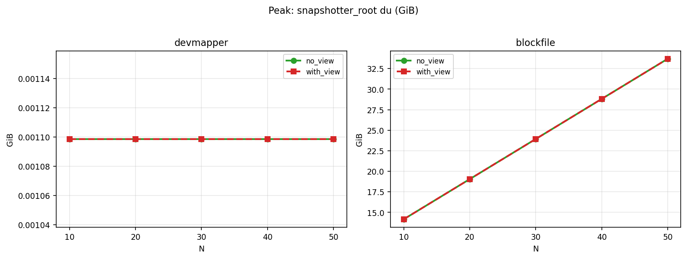
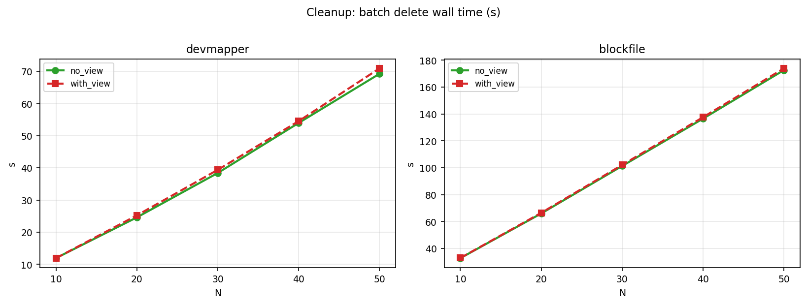

# urunc `view vs no-view` 实验更新

## 快速观察

这轮顺序压测（`N=10/20/30/40/50`）里，目前看到的是“有局部优化信号，但还不能说有稳定净收益”：  
- 在部分指标上有轻微改善信号；  
- 但系统级结果里，`RSS` 和 cleanup 时间并没有体现出净收益；  
- `blockfile` 下固定块分配效应较强，也会掩盖 `view` 的局部优化。

---

## 本轮测试范围

- 模式：`with view` vs `no view`
- snapshotter：`devmapper`、`blockfile`
- 工作负载：顺序启动容器，`N=10,20,30,40,50`

### 指标口径

- `mem_avail`：系统可用内存（来自 `/proc/meminfo`）。
- `RSS(containerd+shim+qemu)`：三类关键进程 RSS 汇总，反映运行态总内存压力。
- `snapshotter_root_bytes`：snapshotter 插件目录 `du` 统计（不同后端解释口径不同）。
- `run_containerd_bytes`：`/run/containerd` 目录 `du`（包含 bundle/monRootfs 等运行期文件）。
- `batch_elapsed_sec`：整批 cleanup 耗时。
- 关于 `mem_avail`：跨 run 的绝对峰值要谨慎看，因为两组 baseline 不完全一致；更有意义的是看“启动前基线 -> 全部启动完成后”的下降量。

### 采样时机

- 启动前基线点（内部 tag：`before_sequential_N`）。
- 该轮 N 个容器全部启动完成后的采样点（内部 tag：`after_start_N_of_N`）。
- cleanup 完成后的采样点（内部 tag：`after_cleanup_sequential_N`）。
- 本文里的主要对比，默认都基于 `with_view - no_view` 的同 N、同 snapshotter 差值。

---

## 数据里目前能看到的现象

### devmapper

- 峰值 `RSS(containerd+shim+qemu)` 在 `with_view` 下持续更高（N 越大差值越明显）。
- 从原始表看，RSS 增量主要体现在 `shim_urunc_rss_sum_kb`，`qemu_rss_sum_kb` 差异相对小，说明更像是 shim/view 生命周期侧开销，而不是 guest 本体显著变大。
- `mem_avail` 有小幅正向变化，但这个结论应以“基线到启动后下降量”解读，而不是只看绝对峰值。
- `snapshotter_root` 峰值几乎重合。
- cleanup 阶段整体偏慢（除个别点外）。

### blockfile

- `mem_avail` 正负交替，未形成稳定收益趋势。
- 峰值 `RSS` 同样在 `with_view` 下更高。
- 同样地，RSS 的主要增量更偏向 `shim_urunc_rss_sum_kb`，`qemu_rss_sum_kb` 变化不大。
- `snapshotter_root` 随 N 增长明显，但两模式峰值差异不大。
- cleanup 也表现为 `with_view` 略慢。

---

## 我的分析

`view` 的优化点是：避免把部分启动相关文件（如 unikernel/initrd/urunc.json）复制到 `monRootfs`，改为基于 snapshot view 的 bind。  
这个优化方向是合理的，但它只覆盖启动路径中的一小段成本，不会自动消除其它开销。

结合现有代码路径和历史实验记录，可以先提出一个工作假设：

- 原有 copy 路径是在 `tmpfs` 上复制 3 个文件（unikernel/initrd/urunc.json）；  
- 在当前测试镜像里，这部分大约对应每容器约 `~7MB` 的内存文件系统占用；  
- 按理说，`view` 应该能省掉这一块 copy 压力；
- 但目前现象是：`view` 一方面带来了额外内存占用（可能与 snapshotter client / view 生命周期管理开销相关），另一方面在之前讨论的并发实验里也观察到它可能会加剧 `devmapper` 的启动时延。

在当前实验里，更可能主导总成本的是：

- qemu/shim/container 启动与运行期开销；
- snapshotter 与 mount/metadata 管理成本；
- cleanup 路径的回收与删除开销；
- blockfile 固定块分配带来的强主导效应。

---

## 当前实验限制

- `with_view` / `no_view` 不是完全同一时刻交替 A/B，存在基线漂移；
- `mem_avail` 如果直接比较绝对峰值，容易被 baseline 差异误导；更应看基线到启动后采样点的下降量；
- `snapshot_count` 在个别点有轻微波动；
- cleanup 采样时机可能混入异步回收噪声；
- blockfile cleanup 行为仍需更细粒度验证；
- 不同 snapshotter 的“存储指标可见性”不一样，解释口径需分开。

---

## `mem_avail` 基线到启动后下降量

下面这张表直接展示 `before -> 全部启动完成后` 的下降量（单位 GiB），用于替代“只看绝对峰值”：

| snapshotter | N | no_view 下降量 | with_view 下降量 | 差值 (with - no) |
|---|---:|---:|---:|---:|
| devmapper | 10 | 1.663 | 1.651 | -0.012 |
| devmapper | 20 | 2.365 | 2.347 | -0.018 |
| devmapper | 30 | 3.218 | 3.351 | +0.133 |
| devmapper | 40 | 4.617 | 4.535 | -0.082 |
| devmapper | 50 | 5.823 | 5.503 | -0.320 |
| blockfile | 10 | 0.954 | 0.950 | -0.004 |
| blockfile | 20 | 2.089 | 1.998 | -0.091 |
| blockfile | 30 | 3.202 | 2.984 | -0.218 |
| blockfile | 40 | 4.209 | 3.974 | -0.235 |
| blockfile | 50 | 5.375 | 5.101 | -0.274 |

按这个口径看：除了 devmapper N=30 外，其余点 `with_view` 的 `mem_avail` 下降量都更小一些，但幅度整体不大，需要和 RSS/cleanup 一起解读。

---

## 关键原始数据摘录

### 1) 全部启动完成后的采样点 devmapper

| mode | N | mem_avail_kb | containerd_main_rss_kb | shim_urunc_rss_sum_kb | qemu_rss_sum_kb | snapshotter_root_bytes | run_containerd_bytes | snapshot_count | running_containers |
|---|---:|---:|---:|---:|---:|---:|---:|---:|---:|
| no_view | 10 | 248314904 | 32508 | 53228 | 1024724 | 1179648 | 125957698 | 29 | 10 |
| with_view | 10 | 248478440 | 37868 | 143864 | 1022620 | 1179648 | 126100588 | 30 | 10 |
| no_view | 20 | 246843956 | 32508 | 118824 | 2069828 | 1179648 | 251906448 | 40 | 20 |
| with_view | 20 | 247027776 | 40620 | 288884 | 2065772 | 1179648 | 252192253 | 41 | 20 |
| no_view | 30 | 245839760 | 32508 | 164484 | 3097156 | 1179648 | 377861598 | 48 | 30 |
| with_view | 30 | 245956880 | 35684 | 410324 | 3081752 | 1179648 | 378290452 | 49 | 30 |
| no_view | 40 | 244673168 | 32508 | 233116 | 4114892 | 1179648 | 503823148 | 59 | 40 |
| with_view | 40 | 244732788 | 35832 | 547356 | 4115332 | 1179648 | 504394954 | 60 | 40 |
| no_view | 50 | 243444748 | 35268 | 283300 | 5160976 | 1179648 | 629791098 | 69 | 50 |
| with_view | 50 | 243586560 | 51908 | 691148 | 5173860 | 1179648 | 630505850 | 71 | 50 |

### 2) 全部启动完成后的采样点 blockfile

| mode | N | mem_avail_kb | containerd_main_rss_kb | shim_urunc_rss_sum_kb | qemu_rss_sum_kb | snapshotter_root_bytes | run_containerd_bytes | snapshot_count | running_containers |
|---|---:|---:|---:|---:|---:|---:|---:|---:|---:|
| no_view | 10 | 248500376 | 32508 | 57876 | 1024656 | 15204614144 | 125957698 | 28 | 10 |
| with_view | 10 | 248340752 | 46996 | 146856 | 1026228 | 15204614144 | 126099043 | 29 | 10 |
| no_view | 20 | 247306408 | 32508 | 115700 | 2063624 | 20447494144 | 251906448 | 38 | 20 |
| with_view | 20 | 247258696 | 51788 | 276760 | 2059460 | 20447494144 | 252189173 | 39 | 20 |
| no_view | 30 | 246017552 | 32508 | 168880 | 3104948 | 25690374144 | 377861598 | 48 | 30 |
| with_view | 30 | 246077888 | 52752 | 408188 | 3102048 | 25690374144 | 378285703 | 49 | 30 |
| no_view | 40 | 245042532 | 35016 | 225292 | 4140136 | 30933254144 | 503823148 | 58 | 40 |
| with_view | 40 | 245035992 | 44232 | 553748 | 4134308 | 30933254144 | 504388633 | 59 | 40 |
| no_view | 50 | 243810548 | 39748 | 286236 | 5162880 | 36176134144 | 629791098 | 68 | 50 |
| with_view | 50 | 243843284 | 57308 | 683500 | 5158616 | 36176134144 | 630497963 | 69 | 50 |

### 3) cleanup 完成后的采样点 devmapper

| mode | N | batch_elapsed_sec | mem_avail_kb | snapshotter_root_bytes | run_containerd_bytes | snapshot_count | running_containers |
|---|---:|---:|---:|---:|---:|---:|---:|
| no_view | 10 | 11.930104 | 249229028 | 1179648 | 15348 | 18 | 0 |
| with_view | 10 | 11.910459 | 249370956 | 1179648 | 15348 | 18 | 0 |
| no_view | 20 | 24.590242 | 249013080 | 1179648 | 15348 | 18 | 0 |
| with_view | 20 | 25.210551 | 249217436 | 1179648 | 15348 | 18 | 0 |
| no_view | 30 | 38.386461 | 249256648 | 1179648 | 15348 | 18 | 0 |
| with_view | 30 | 39.363232 | 249156184 | 1179648 | 15348 | 18 | 0 |
| no_view | 40 | 53.939509 | 249309072 | 1179648 | 15348 | 18 | 0 |
| with_view | 40 | 54.497614 | 249130544 | 1179648 | 15348 | 18 | 0 |
| no_view | 50 | 69.225268 | 249261788 | 1179648 | 15348 | 18 | 0 |
| with_view | 50 | 70.900510 | 249115928 | 1179648 | 15348 | 18 | 0 |

### 4) cleanup 完成后的采样点 blockfile

| mode | N | batch_elapsed_sec | mem_avail_kb | snapshotter_root_bytes | run_containerd_bytes | snapshot_count | running_containers |
|---|---:|---:|---:|---:|---:|---:|---:|
| no_view | 10 | 32.722383 | 249421000 | 12058886144 | 15348 | 18 | 0 |
| with_view | 10 | 32.865807 | 249296476 | 12058886144 | 15348 | 18 | 0 |
| no_view | 20 | 65.979176 | 249346708 | 12058886144 | 15348 | 18 | 0 |
| with_view | 20 | 66.430903 | 249118792 | 12058886144 | 15348 | 18 | 0 |
| no_view | 30 | 101.300709 | 249364368 | 12583174144 | 15348 | 18 | 0 |
| with_view | 30 | 102.049901 | 249099836 | 12058886144 | 15348 | 18 | 0 |
| no_view | 40 | 136.507869 | 249376008 | 12058886144 | 15348 | 18 | 0 |
| with_view | 40 | 137.544523 | 249056540 | 11534598144 | 15348 | 18 | 0 |
| no_view | 50 | 172.589100 | 249345964 | 12058886144 | 15348 | 18 | 0 |
| with_view | 50 | 173.901752 | 249008724 | 12583174144 | 15348 | 18 | 0 |

## Quick summary (for top post)

- 本轮实验中，`view` 未呈现稳定系统级净收益。  
- 两个 snapshotter 下峰值 RSS 均在 `with_view` 更高。  
- `devmapper` 有轻微内存正向信号，但幅度较小。  
- `blockfile` 下固定块分配效应很强，容易淹没局部优化。  
- cleanup 时间普遍 `with_view` 更慢一些。  
- 结合代码路径，当前更像是“省了局部 copy，但被其他路径开销抵消”。  

---

# urunc `view vs no-view` Evaluation Update

## Quick takeaway

In this sequential startup test (`N=10/20/30/40/50`), what we see so far is: there are local optimization signals, but no stable net gain at system level yet.
- Some metrics show small positive signs.
- But at system level, `RSS` and cleanup time do not show a clear net benefit.
- Under `blockfile`, fixed block allocation is strong enough to hide local view-path improvements.

---

## What we tested

- Modes: `with view` vs `no view`
- Snapshotters: `devmapper`, `blockfile`
- Workload: sequential container startup, `N=10,20,30,40,50`

### Metric scope

- `mem_avail`: system available memory (from `/proc/meminfo`)
- `RSS(containerd+shim+qemu)`: sum RSS of key runtime processes
- `snapshotter_root_bytes`: `du` size of snapshotter plugin directory
- `run_containerd_bytes`: `du` size of `/run/containerd` (includes runtime bundle/monRootfs artifacts)
- `batch_elapsed_sec`: total cleanup time of one batch
- For `mem_avail`, absolute peak values across runs should be interpreted carefully because baselines differ; the more meaningful signal is the drop from baseline to the point after all N containers are started.

### Sampling points

- Startup baseline point (internal tag: `before_sequential_N`)
- Point after all N containers are started (internal tag: `after_start_N_of_N`)
- Point after cleanup is completed (internal tag: `after_cleanup_sequential_N`)
- Main comparisons here are based on same N + same snapshotter pairs, with `with_view - no_view`.

---

## What the data currently shows

### devmapper

- Peak `RSS(containerd+shim+qemu)` is consistently higher with `with_view`.
- From the raw table, most RSS increase appears in `shim_urunc_rss_sum_kb`, while `qemu_rss_sum_kb` differences are relatively small. This looks more like shim/view lifecycle overhead than a larger guest footprint.
- `mem_avail` shows small positive shifts, but this should be read using baseline-to-post-start drop, not absolute peak-only comparison.
- Peak `snapshotter_root` is almost identical between modes.
- Cleanup is generally slower with `with_view` (except one small point).

### blockfile

- `mem_avail` alternates in sign; no stable trend.
- Peak `RSS` is also higher with `with_view`.
- The RSS increase is also mostly on the shim side (`shim_urunc_rss_sum_kb`), with smaller changes in `qemu_rss_sum_kb`.
- `snapshotter_root` grows strongly with N, while mode differences are small.
- Cleanup is also slightly slower with `with_view`.

---

## My current analysis

The optimization target of `view` is clear: avoid copying boot artifacts (`unikernel/initrd/urunc.json`) into `monRootfs`, and bind from snapshot view instead.
This is a valid optimization direction, but it only covers a narrow part of the startup path.

Based on current code-path notes and previous experiment logs, one working hypothesis is:

- The original path copies 3 files on `tmpfs` (`unikernel/initrd/urunc.json`).
- In the current test image, this is roughly `~7MB` memory filesystem footprint per container.
- So view should reduce that part of copy pressure.
- But in current observations, view may introduce extra memory overhead (possibly from snapshotter client/view lifecycle management), and previous concurrent tests also suggested possible extra startup delay on devmapper.

In this run, total cost is likely dominated by:

- qemu/shim/container startup/runtime overhead
- snapshotter + mount/metadata management overhead
- cleanup/reclaim overhead
- strong fixed-allocation behavior in blockfile

---

## Current experiment limitations

- `with_view` / `no_view` are not strict alternating A/B in the exact same run window; baseline drift exists.
- For `mem_avail`, absolute peak comparisons can be misleading under baseline drift; baseline-to-post-start drop is more reliable.
- `snapshot_count` has small fluctuations at some points.
- Cleanup sampling timing may include async reclaim noise.
- Blockfile cleanup behavior still needs finer validation.
- Storage interpretation differs by snapshotter backend.

---

## `mem_avail` baseline-to-post-start drop

The table below shows `before -> point after all N containers are started` drop (GiB), which is more reliable than peak absolute-only comparison:

| snapshotter | N | no_view drop | with_view drop | diff (with - no) |
|---|---:|---:|---:|---:|
| devmapper | 10 | 1.663 | 1.651 | -0.012 |
| devmapper | 20 | 2.365 | 2.347 | -0.018 |
| devmapper | 30 | 3.218 | 3.351 | +0.133 |
| devmapper | 40 | 4.617 | 4.535 | -0.082 |
| devmapper | 50 | 5.823 | 5.503 | -0.320 |
| blockfile | 10 | 0.954 | 0.950 | -0.004 |
| blockfile | 20 | 2.089 | 1.998 | -0.091 |
| blockfile | 30 | 3.202 | 2.984 | -0.218 |
| blockfile | 40 | 4.209 | 3.974 | -0.235 |
| blockfile | 50 | 5.375 | 5.101 | -0.274 |

Using this view, `with_view` has a smaller drop in most points (except devmapper N=30), but the magnitude is modest and should be interpreted together with RSS and cleanup behavior.

---

## Key raw data excerpts

### 1) Points after all N containers are started devmapper

| mode | N | mem_avail_kb | containerd_main_rss_kb | shim_urunc_rss_sum_kb | qemu_rss_sum_kb | snapshotter_root_bytes | run_containerd_bytes | snapshot_count | running_containers |
|---|---:|---:|---:|---:|---:|---:|---:|---:|---:|
| no_view | 10 | 248314904 | 32508 | 53228 | 1024724 | 1179648 | 125957698 | 29 | 10 |
| with_view | 10 | 248478440 | 37868 | 143864 | 1022620 | 1179648 | 126100588 | 30 | 10 |
| no_view | 20 | 246843956 | 32508 | 118824 | 2069828 | 1179648 | 251906448 | 40 | 20 |
| with_view | 20 | 247027776 | 40620 | 288884 | 2065772 | 1179648 | 252192253 | 41 | 20 |
| no_view | 30 | 245839760 | 32508 | 164484 | 3097156 | 1179648 | 377861598 | 48 | 30 |
| with_view | 30 | 245956880 | 35684 | 410324 | 3081752 | 1179648 | 378290452 | 49 | 30 |
| no_view | 40 | 244673168 | 32508 | 233116 | 4114892 | 1179648 | 503823148 | 59 | 40 |
| with_view | 40 | 244732788 | 35832 | 547356 | 4115332 | 1179648 | 504394954 | 60 | 40 |
| no_view | 50 | 243444748 | 35268 | 283300 | 5160976 | 1179648 | 629791098 | 69 | 50 |
| with_view | 50 | 243586560 | 51908 | 691148 | 5173860 | 1179648 | 630505850 | 71 | 50 |

### 2) Points after all N containers are started blockfile

| mode | N | mem_avail_kb | containerd_main_rss_kb | shim_urunc_rss_sum_kb | qemu_rss_sum_kb | snapshotter_root_bytes | run_containerd_bytes | snapshot_count | running_containers |
|---|---:|---:|---:|---:|---:|---:|---:|---:|---:|
| no_view | 10 | 248500376 | 32508 | 57876 | 1024656 | 15204614144 | 125957698 | 28 | 10 |
| with_view | 10 | 248340752 | 46996 | 146856 | 1026228 | 15204614144 | 126099043 | 29 | 10 |
| no_view | 20 | 247306408 | 32508 | 115700 | 2063624 | 20447494144 | 251906448 | 38 | 20 |
| with_view | 20 | 247258696 | 51788 | 276760 | 2059460 | 20447494144 | 252189173 | 39 | 20 |
| no_view | 30 | 246017552 | 32508 | 168880 | 3104948 | 25690374144 | 377861598 | 48 | 30 |
| with_view | 30 | 246077888 | 52752 | 408188 | 3102048 | 25690374144 | 378285703 | 49 | 30 |
| no_view | 40 | 245042532 | 35016 | 225292 | 4140136 | 30933254144 | 503823148 | 58 | 40 |
| with_view | 40 | 245035992 | 44232 | 553748 | 4134308 | 30933254144 | 504388633 | 59 | 40 |
| no_view | 50 | 243810548 | 39748 | 286236 | 5162880 | 36176134144 | 629791098 | 68 | 50 |
| with_view | 50 | 243843284 | 57308 | 683500 | 5158616 | 36176134144 | 630497963 | 69 | 50 |

### 3) Points after cleanup is completed devmapper

| mode | N | batch_elapsed_sec | mem_avail_kb | snapshotter_root_bytes | run_containerd_bytes | snapshot_count | running_containers |
|---|---:|---:|---:|---:|---:|---:|---:|
| no_view | 10 | 11.930104 | 249229028 | 1179648 | 15348 | 18 | 0 |
| with_view | 10 | 11.910459 | 249370956 | 1179648 | 15348 | 18 | 0 |
| no_view | 20 | 24.590242 | 249013080 | 1179648 | 15348 | 18 | 0 |
| with_view | 20 | 25.210551 | 249217436 | 1179648 | 15348 | 18 | 0 |
| no_view | 30 | 38.386461 | 249256648 | 1179648 | 15348 | 18 | 0 |
| with_view | 30 | 39.363232 | 249156184 | 1179648 | 15348 | 18 | 0 |
| no_view | 40 | 53.939509 | 249309072 | 1179648 | 15348 | 18 | 0 |
| with_view | 40 | 54.497614 | 249130544 | 1179648 | 15348 | 18 | 0 |
| no_view | 50 | 69.225268 | 249261788 | 1179648 | 15348 | 18 | 0 |
| with_view | 50 | 70.900510 | 249115928 | 1179648 | 15348 | 18 | 0 |

### 4) Points after cleanup is completed blockfile

| mode | N | batch_elapsed_sec | mem_avail_kb | snapshotter_root_bytes | run_containerd_bytes | snapshot_count | running_containers |
|---|---:|---:|---:|---:|---:|---:|---:|
| no_view | 10 | 32.722383 | 249421000 | 12058886144 | 15348 | 18 | 0 |
| with_view | 10 | 32.865807 | 249296476 | 12058886144 | 15348 | 18 | 0 |
| no_view | 20 | 65.979176 | 249346708 | 12058886144 | 15348 | 18 | 0 |
| with_view | 20 | 66.430903 | 249118792 | 12058886144 | 15348 | 18 | 0 |
| no_view | 30 | 101.300709 | 249364368 | 12583174144 | 15348 | 18 | 0 |
| with_view | 30 | 102.049901 | 249099836 | 12058886144 | 15348 | 18 | 0 |
| no_view | 40 | 136.507869 | 249376008 | 12058886144 | 15348 | 18 | 0 |
| with_view | 40 | 137.544523 | 249056540 | 11534598144 | 15348 | 18 | 0 |
| no_view | 50 | 172.589100 | 249345964 | 12058886144 | 15348 | 18 | 0 |
| with_view | 50 | 173.901752 | 249008724 | 12583174144 | 15348 | 18 | 0 |

## Quick summary

- In this run, `view` does not show a stable net system-level gain.
- Peak RSS is higher with `with_view` in both snapshotters.
- devmapper shows small positive signals in `mem_avail`, but the magnitude is limited.
- Under blockfile, fixed allocation effects are very strong and can hide local view-path benefits.
- Cleanup is generally a bit slower with `with_view`.
- Based on code-path understanding, this currently looks like: one local copy-saving optimization offset by other overheads.

