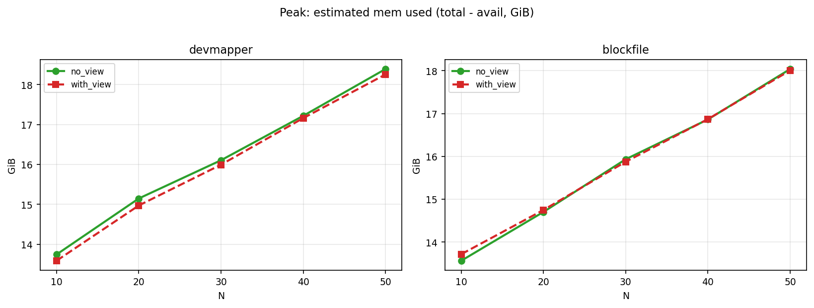
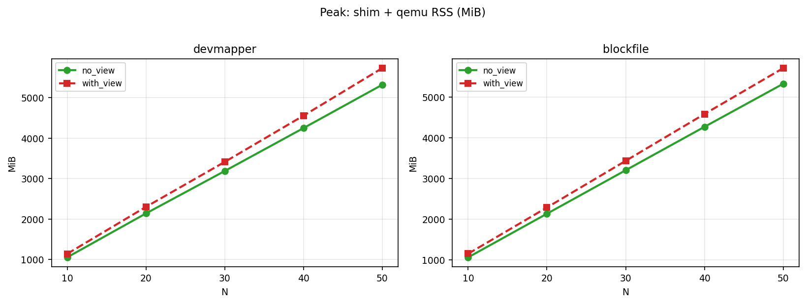
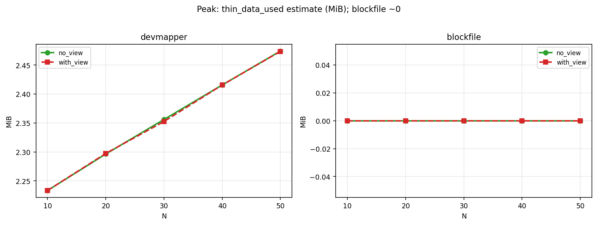
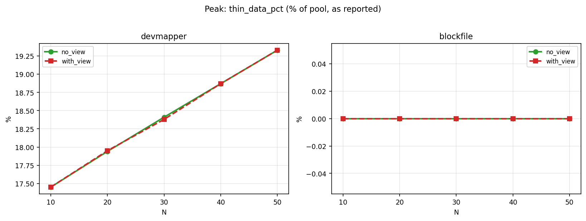

# Snapshot View 对比资源分析报告

基于现有数据集：

- `scripts/perf/data/no_view_2026-04-05/sequential_all_no_view_merged.tsv`
- `scripts/perf/data/with_view_2026-04-06/sequential_all_with_view_merged.tsv`
- 图表由 `scripts/perf/data/view_compare_2026-04-06/analyze_all.py` 生成

对比维度是 `with_view - no_view`，场景为顺序启动 `N=10,20,30,40,50`，并分别看 `devmapper` 与 `blockfile`。

---

## 结论先看

1. 在这批数据里，`with_view` **没有体现出稳定的总体资源收益**。  
2. 两个 snapshotter 下，峰值 `RSS(containerd+shim+qemu)` 都是 `with_view` 更高，`N=50` 约 **+400 MiB**。  
3. `mem_avail` 在 `devmapper` 略有提升，但在 `blockfile` 上正负交替，无法形成一致结论。  
4. `snapshotter_root_bytes` 的峰值几乎无差异（两组数据到当前统计精度基本重合）。  
5. cleanup 阶段 `with_view` 普遍更慢（尤其 N 增大时更明显）。

---

## 图表总览

### 1) 峰值可用内存（mem_avail）

### 2) 峰值已用内存（mem_total - mem_avail）

### 3) 峰值 RSS 总和（containerd + shim + qemu）

### 4) 峰值 shim+qemu RSS

### 5) devmapper thin data（估算）

### 6) devmapper thin data 百分比

### 7) snapshotter 插件目录大小（du）

### 8) `/run/containerd` 大小（du）

### 9) cleanup 整批耗时

### 10) 峰值各指标差值总览（with_view - no_view）

### 11) N=50 相对变化百分比

### 12) cleanup 额外耗时差值

---

## 分 snapshotter 结果

### devmapper

- `mem_avail`：`with_view` 相对 `no_view` 为 **+0.057 ~ +0.175 GiB**（轻微正向）。  
- `RSS 总和`：持续更高，`N=50` 达 **+427.1 MiB**。  
- `/run/containerd`：小幅更高，`N=50` 为 **+0.7 MiB**。  
- `snapshotter_root`：几乎无差异。  
- cleanup：除 `N=10` 外均更慢，`N=50` 为 **+1.68s**。

### blockfile

- `mem_avail`：`-0.152, -0.046, +0.058, -0.006, +0.031 GiB`，波动较大且不稳定。  
- `RSS 总和`：持续更高，`N=50` 为 **+400.9 MiB**。  
- `/run/containerd`：小幅更高，`N=50` 为 **+0.7 MiB**。  
- `snapshotter_root`：峰值基本重合（无明显差异）。  
- cleanup：全部为正增量，`N=50` 为 **+1.31s**。

---

## 结合代码的原因分析

### A. View 优化点是“避免部分文件复制”，不是全路径去拷贝

在 `pkg/unikontainers/block.go` 的 `handleCntrRootfsAsBlock()` 中：

- `FromSnapshotView=true` 时走 `bindViewFilesToMonRootfs()`，明确是 bind mount，注释写了 **no copy / no storage overhead**。  
- 但同一路径仍会调用 `copyMountfiles(rfs.MountedPath, mounts)`。  

这意味着：view 省掉的是“view 文件到 monRootfs 的那一份复制”，不是把整个 rootfs 相关 copy 全部取消。

### B. 无 view 路径确实存在复制到 monRootfs

同一函数在 `FromSnapshotView=false` 时会走 `prepareDMAsBlock(...)`，把 unikernel/initrd/urunc.json 拷贝到 `MonRootfs` 侧。  
而 `MonRootfs` 是 `switchMonRootfs()` 在 bundle 下创建的 `bundle/monRootfs`（`pkg/unikontainers/rootfs.go`）。

### C. 共享 view 本身引入管理成本

`pkg/shiminject/inject.go` 的 `CreateSnapshotView()` / `CleanupSnapshotView()` 显示了 view 生命周期包含：

- shared view lock 与 users marker 管理；  
- 创建/复用 containerd snapshot view + lease；  
- cleanup 时需 unmount、删除 marker、尝试移除 view snapshot 与 lease。  

这与数据里 cleanup 普遍更慢相吻合：view 机制带来额外的路径管理与回收动作。

### D. 采样口径会放大小差异噪声

`scripts/perf/lib_bench_common.sh` 的 `bench_resource_sample_line_v2()` 采集的是系统级聚合指标（meminfo、RSS 汇总、`du /run/containerd`、`du snapshotter_root` 等）。  
这类指标对“是否省了一份特定文件复制”并不总是敏感，尤其当 qemu/shim 主导内存时，局部优化可能被全局波动淹没。

---

## 解释“为什么没看到明显收益”

从当前数据和代码对应关系看，最可能是以下叠加：

- 被省掉的复制体量（unikernel/initrd/urunc.json）在这个 workload 下不够大；  
- view 增加了 shared view 管理开销（创建/复用/清理）；  
- 观测口径偏全局，难放大局部优化；  
- 非严格同轮 A/B（不同日期数据集）会引入基线漂移。

---

## 下一步建议（让结论更“可证伪”）

1. 在采样里增加 `bundle/monRootfs` 粒度的 `du`，直接观测 view 命中的对象。  
2. 补采 `meminfo` 的 `Shmem`，验证 tmpfs/shmem 的变化。  
3. 用更大 initrd/kernel 工件放大 copy 差异，再跑同矩阵。  
4. 同机同版本做交替 A/B（no_view, with_view, no_view, with_view）并取中位数。  
5. 将 `prepareDMAsBlock` 与 `bindViewFilesToMonRootfs` 的 phase duration 单独汇总成启动阶段微基准。

---

> 报告依据：当前仓库数据文件与 `pkg/unikontainers/block.go`、`pkg/unikontainers/rootfs.go`、`pkg/shiminject/inject.go`、`scripts/perf/lib_bench_common.sh` 的现有实现。  
> 如后续变更 view 生命周期或 rootfs 处理逻辑，应同步更新该报告结论。
