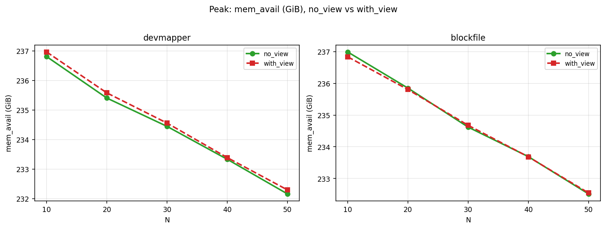
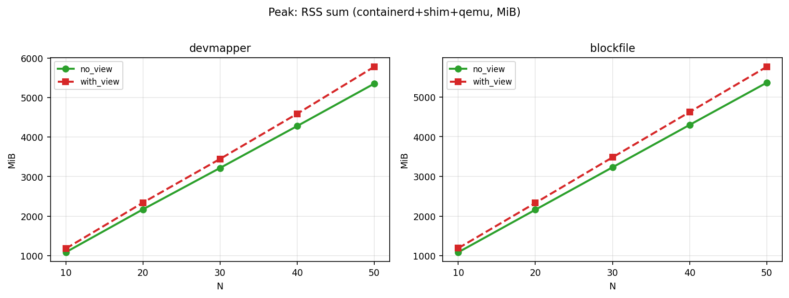
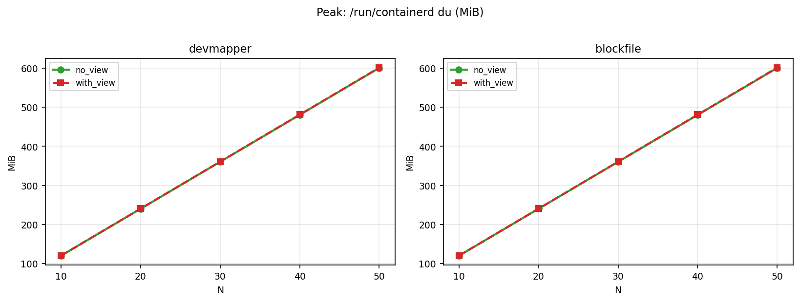
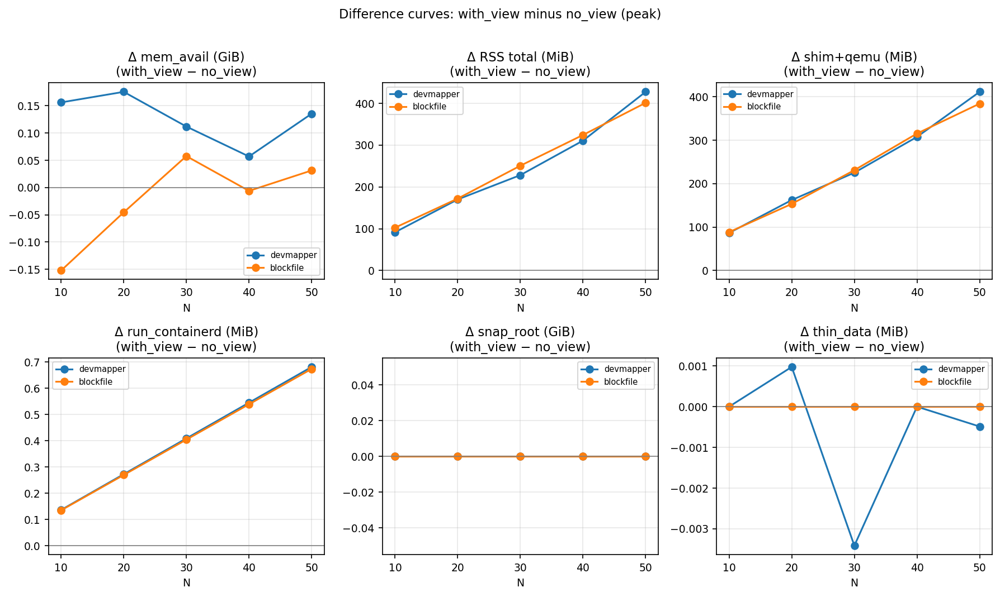
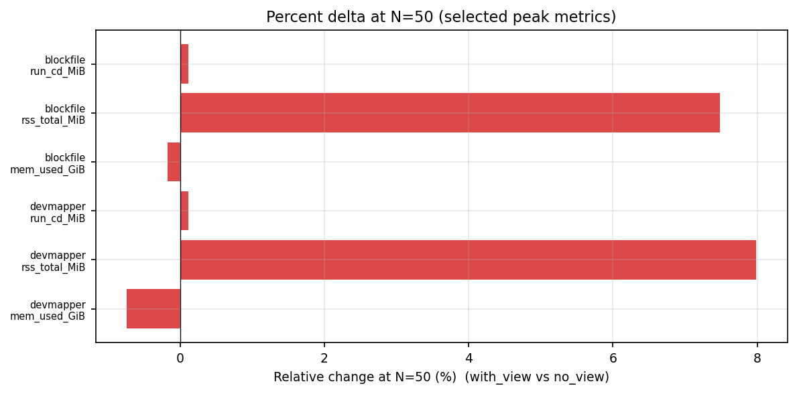
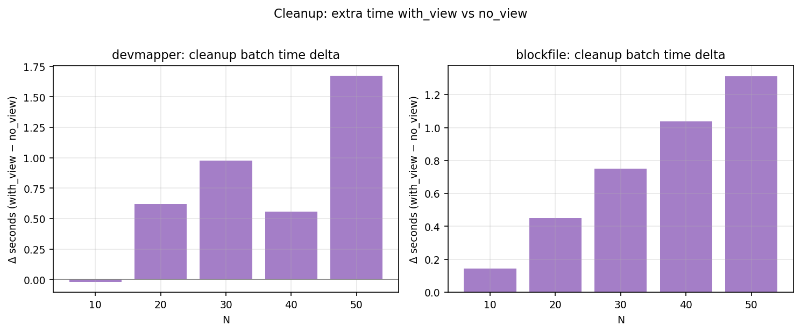

# Snapshot View Benchmark (Experiment 1)

This report is written for external readers who do **not** need repository context or raw CSV/TSV files.

## 1) Experiment 1 Conditions

### Goal

Compare `with_view` vs `no_view` under the same workload, and evaluate impact on:

- Memory usage
- Runtime/storage footprint
- Cleanup latency

for two snapshotter backends:

- `devmapper`
- `blockfile`

### Workload

- Sequential container startup
- Test points: `N = 10, 20, 30, 40, 50` running containers
- For each N: run both backends and both modes (`no_view`, `with_view`)

### Comparison Rule

All deltas in this report are:

`delta = with_view - no_view`

---

## 2) Metrics and Method

### Metrics

- `mem_avail`: available system memory (GiB)
- `RSS total`: sum of container runtime processes (containerd + shim + qemu), in MiB
- `snapshotter_root_bytes`: snapshotter plugin directory size (`du`)
- `run_containerd_bytes`: `/run/containerd` tree size (`du`)
- `thin_data_used_bytes` / `thin_data_pct`: devmapper thin-pool usage
- `batch_elapsed_sec`: wall-clock cleanup time after each run

### Method

- Peak resource point: measured at the end of each startup batch (`after_start_N_of_N`)
- Cleanup point: measured after container removal (`after_cleanup_sequential_N`)
- Curves and summary charts are generated with one script to keep the same aggregation logic

---

## 3) Key Results

### 3.1 Memory (most important)

- `RSS total` is consistently higher with `with_view` on both backends.
- At `N=50`:
  - `devmapper`: **+427.1 MiB**
  - `blockfile`: **+400.9 MiB**

### 3.2 Available memory

- `devmapper`: small positive change (`+0.057 ~ +0.175 GiB`)
- `blockfile`: mixed signs (`-0.152, -0.046, +0.058, -0.006, +0.031 GiB`), no stable gain

### 3.3 Storage/runtime footprint

- `snapshotter_root_bytes`: almost overlapping at peak; no clear separation
- `run_containerd_bytes`: small change only; around `+0.7 MiB` at `N=50`

### 3.4 Cleanup latency

- Cleanup is generally slower with `with_view`.
- At `N=50`:
  - `devmapper`: **+1.68 s**
  - `blockfile`: **+1.31 s**

### 3.5 Quick numeric table (N=50)

| Metric | devmapper | blockfile |
|---|---:|---:|
| Delta `mem_avail` (GiB) | +0.135 | +0.031 |
| Delta `RSS total` (MiB) | +427.1 | +400.9 |
| Delta `run_containerd` (MiB) | +0.7 | +0.7 |
| Delta cleanup time (s) | +1.68 | +1.31 |

---

## 4) Important Charts

### Peak available memory

### Peak RSS total

### Peak `/run/containerd` size

### Peak delta overview (`with_view - no_view`)

### Relative deltas at N=50

### Extra cleanup time

---

## 5) Conclusion (Community-facing)

> In Experiment 1, Snapshot View does not show a stable net resource benefit at the system level under the tested workload.  
> The dominant observation is higher peak RSS and slower cleanup in `with_view`, while available-memory and storage indicators remain small or inconsistent.  
> This suggests Snapshot View benefits are likely workload- and metric-sensitive, and should be validated with stricter A/B runs and finer-grained measurements.

---

## 6) Notes for Readers

- This is a **single experiment design** (sequential startup, fixed N points).  
- The report intentionally includes all critical numbers and plots so readers can evaluate findings without raw files.  
- A reproducibility package (raw data + scripts + environment manifest) can be published separately if needed.

---

## 7) Data Collection Timing and Logic

This section focuses only on **when** data is recorded and **how** rows are selected for analysis.

### 7.1 Sampling timeline (per run)

TSV sampling is event-driven and written in this order:

1. **Pre-run sample** (`before_*`)  
   A baseline row is recorded before the main startup loop.
2. **In-run samples** (`after_start_i_of_N`)  
   A row is recorded during startup at fixed intervals (for this report, effectively each target step used in analysis includes the end-point `i=N`).
3. **Post-cleanup sample** (`after_cleanup_*`)  
   A row is recorded immediately after cleanup/removal.
4. **Optional settle samples** (`*_settle_5s`, `*_settle_15s`, ...)  
   Additional delayed rows can be appended after cleanup to capture asynchronous reclaim/GC behavior.

### 7.2 Row tags and selection rules

- **Peak analysis** uses only rows tagged: `after_start_N_of_N`
- **Cleanup analysis** uses only rows tagged: `after_cleanup_sequential_N`
- The comparison is always pointwise at the same N and snapshotter:
  - `delta = with_view - no_view`

### 7.3 Aggregation logic used in plots

- Group by `snapshotter` (`devmapper`, `blockfile`) and N (`10..50`)
- For memory/process charts, use the sampled values directly
- For RSS summary, compute:
  - `RSS total = containerd_main_rss + shim_urunc_rss_sum + qemu_rss_sum`
- For storage charts, use sampled directory sizes and backend-specific counters
- For cleanup chart, use sampled `batch_elapsed_sec`

### 7.4 Why this timing matters

- Separating **pre-run**, **peak-point**, and **post-cleanup** rows allows us to distinguish:
  - startup-phase pressure
  - peak steady-state footprint
  - end-of-life cleanup cost
- Optional settle rows help avoid over-interpreting immediate post-cleanup snapshots when reclaim is delayed.

We plan to clean up and publish these benchmark scripts in the maintainer's repository, together with sampling/tagging documentation, so community users can reproduce the same timing logic.
